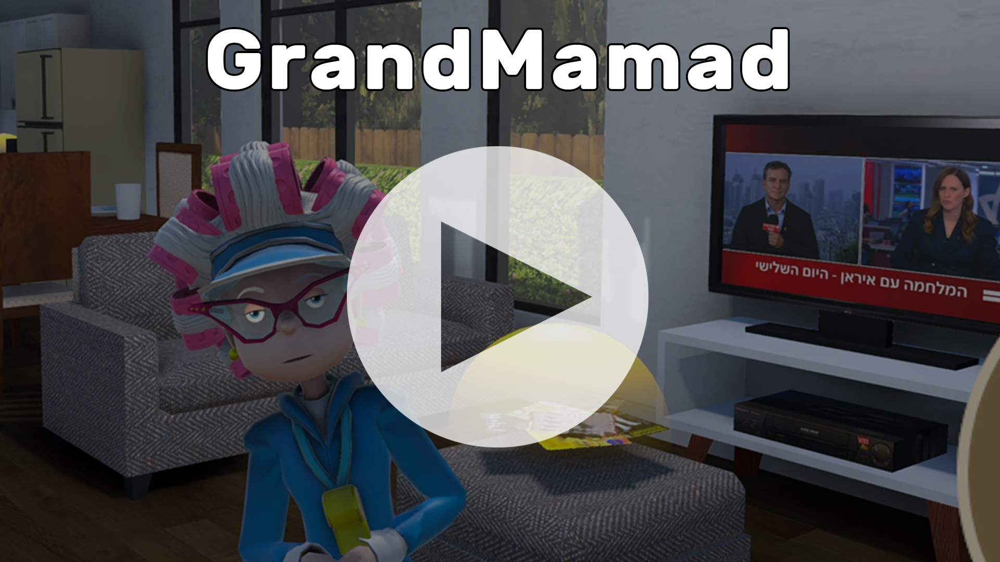
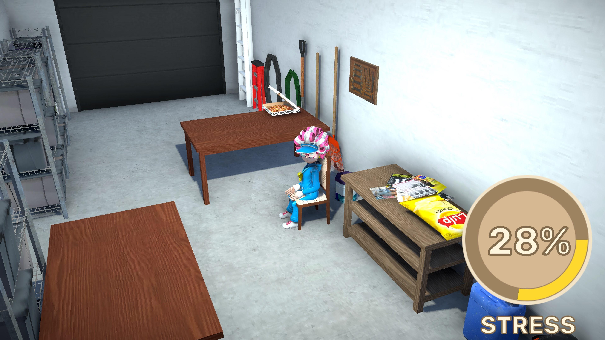
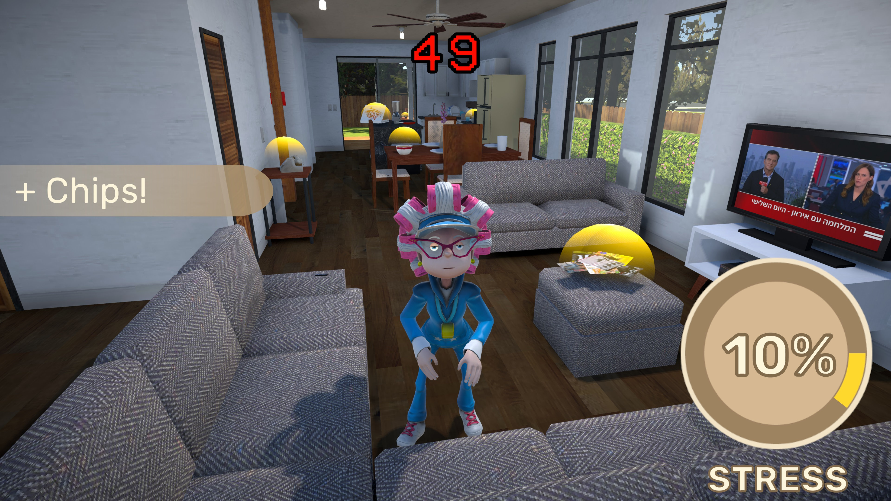
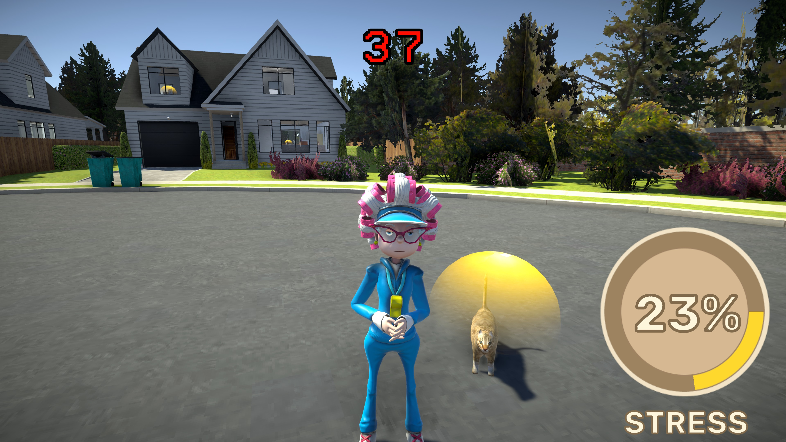
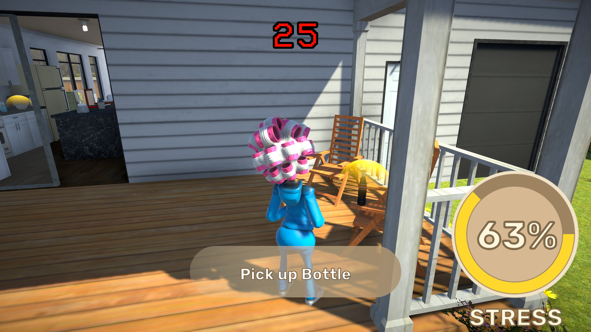

# 🧓 Grandmamad

👉 **Play now on Itch.io (WebGL)**: [https://thefanic.itch.io/grandmamad](https://thefanic.itch.io/grandmamad)

🎬 Watch gameplay preview:  

**Grandmamad** is a 3D Unity game where you race to safety as a stylish Israeli grandmother. Collect comfort items and rush to the *Mamad* (shelter) before stress takes over!

This game was created during **JamMamad 2025**, a 30-hour online game jam held on June 20–21, 2025.

The jam's theme was **“Safe Zone”**, inviting participants to explore what safety means — a place, a feeling, or a concept — and express it through gameplay.

---

## 🖼️ Screenshots

<table>
  <tr>
    <td></td>
    <td></td>
  </tr>
  <tr>
    <td></td>
    <td></td>
  </tr>
</table>

---

## 🎮 Gameplay

- 🚨 Manage rising stress with a dynamic stress bar  
- 🧓 Enter the Mamad to trigger a cozy cutscene  
- 🎥 Smooth camera fades, sitting animations, and item displays  
- 🔁 After each Mamad, Granny resets to the next level or phase  

---

## 🧠 Features

- Stress system with real-time increase and collectible-based reduction  
- Modular cutscene system with camera switches and fade transitions  
- Collectible item spawning and shelter display  
- Level-based Granny reset system  
- Clean, component-based Unity architecture  
- 📱 **Mobile (touch joystick) support**  
- 🕹️ **WebGL playable**  
- 🧠 **Interactive tutorial system** (auto-pauses game)  
- 🏆 **Best record saved via PlayerPrefs**

---

## 🧼 Status

🧪 Prototype / In Development  
🎮 Built in 30 hours during **JamMamad 2025**  
🌐 Designed as a modular system for future level expansion  
